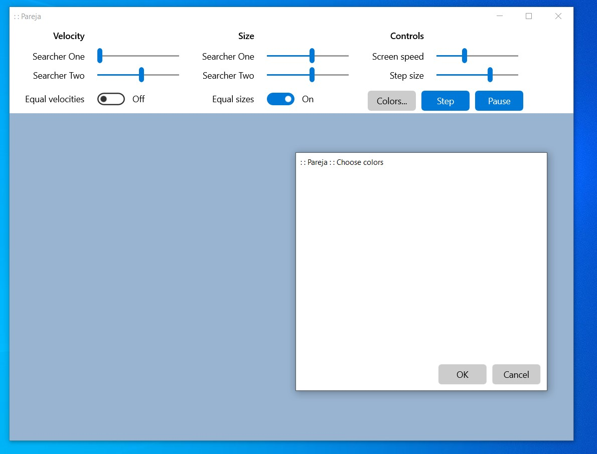

### Pareja

This is a work in progress.

This is a Win32 app which uses XAML Islands. I use XAML Islands instead of WinUI 3 because I also need Direct2D. Although Microsoft don't say explicitly that WinUI 3 does not support Direct2D, that seems to be the case.

This is a current screen shot of the app:

